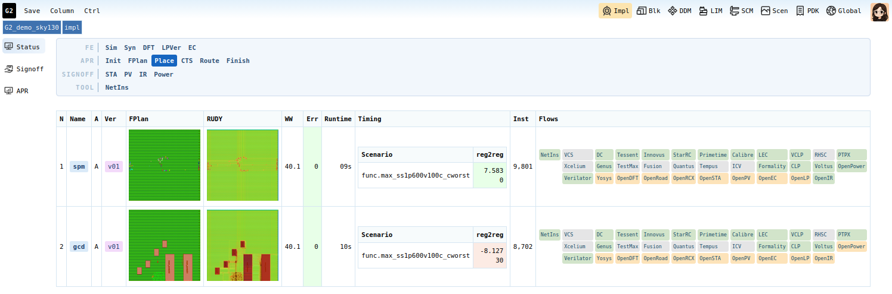

# G2_demo_sky130

A ready-made [G2](https://github.com/DeepDataFlow/G2) project on the
**SkyWater 130nm (sky130)** PDK. Clone it into your G2 workspace and you
can start working on real designs right away. You don't need to set up a
project, scenarios or libraries yourself.



*The Impl Status view at the Place stage of the `v01` run. For each block,
it shows the floorplan, the RUDY congestion map, errors, runtime,
instance count, reg2reg timing, and the flows used.*

## What's Inside

| | |
|---|---|
| **Blocks** | `gcd` and `spm`, each with implementation version `v01` |
| **Design data (DDM)** | RTL, SDC (syn / APR / signoff × `func`, `shift`), UPF and floorplan |
| **Signoff scenarios** | 2 modes (`func`, `shift`) × 4 PVT corners |
| **Libraries (LIM)** | `sky130_fd_sc_hd`, `sky130_fd_sc_hdll` stdcells, and `fakeram45` memory macros |
| **Flows in `v01`** | Yosys, OpenDFT, OpenROAD, OpenRCX, OpenSTA, OpenPV, OpenIR, OpenPower, OpenEC and OpenLP, already checked out and configured |
| **Reference results** | QoR from a previous `v01` run (per-stage OpenROAD timing, floorplan and congestion images) |

The reference results let you compare your own runs against a known
baseline right away.

Large generated files aren't in Git: netlists, the `syn` / `apr_*` DDM
data, logs and databases. You regenerate them when you run the flows.

## Requirements

- A working G2 workspace. See the
  [G2 Quick Start](https://github.com/DeepDataFlow/G2#quick-start).
- The G2 release package, which provides the sky130 PDK in
  `$G2_ROOT/../pdk/sky130`.

## Quick Start

```bash
# 1. Load your G2 environment
cd <your G2 workspace>
source g2.rc

# 2. Clone the project into the workspace's projs/ directory
cd $G2_SYS/projs
git clone https://github.com/DeepDataFlow/G2_demo_sky130

# 3. Link the sky130 PDK and install the libraries from your G2 package
cd G2_demo_sky130
make setup
```

Refresh the G2 web UI. **G2_demo_sky130** now appears in your project list.

`make setup` must be run **inside the project directory** with `g2.rc`
already sourced. It runs two scripts:

| Script | What it does |
|---|---|
| `.scripts/setup_pdk.tcl` | Points `spec/pdk` at the sky130 tech LEF, RC, RCX and KLayout files in your G2 package, and sets the synthesis corner |
| `.scripts/install_library.tcl` | Installs the stdcell and memory libraries into LIM and parses every liberty file |

## Try It

1. Open **Impl → gcd → v01** to see the reference results.
2. Run the flows in order: **yosys** → **openroad** → **openrcx** →
   **opensta** → **openpv**. Every flow uses the same steps: go to the
   **Exec** view, click **Gen**, then **Run**, then **QoR**.
3. Compare your QoR against the reference numbers.
4. Experiment with a new version, such as `v02`: change the clock
   target, utilization or scripts, then compare `v01` and `v02` side by
   side in the **Status** view.

A good first challenge: the `v01` baseline for gcd at 1 GHz does not meet
setup timing at the slow corner. See how close you can get.

## Project Layout

```
G2_demo_sky130/
├── spec/        project settings, block specs, signoff scenarios, PDK paths
├── lim/         libraries (stdcell, mem, hip, io)
├── ddm/         versioned design data (rtl, sdc, upf, syn, apr_*)
├── impl/        implementation runs: impl/<block>/<version>/<flow>
├── scm/         flow scripts
├── checklist/   QA checklists
├── docs/        project documents
└── .scripts/    setup scripts called by `make setup`
```

## Troubleshooting

| Symptom | Fix |
|---|---|
| `sd: command not found` during `make setup` | Run `source g2.rc` in your workspace first. |
| `make setup` can't find PDK files | Check that `$G2_ROOT/../pdk/sky130` exists. It ships in the G2 release package. |
| The project doesn't appear in the UI | Make sure you cloned it into `$G2_SYS/projs/`, then refresh the page. |
| Flows fail with missing netlist or `syn` data | Expected on a fresh clone. Run yosys first and check its netlist into DDM. |
